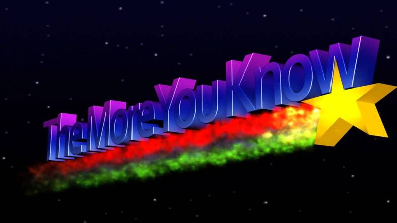

Did you know that .cool is a valid TLD?

As I write this, I am sitting on an airplane bound for Boston, where I will (co-)run [MIT Mystery Hunt 2k19](http://www.mit.edu/~puzzle/nexthunt.html) (a puzzle hunt). For now, the contents of the Hunt are super-secret. Once the puzzles are publicly available (estimate a week), I will post here the puzzles that I wrote. There are between three and seven such puzzles, depending how you count.

If you’re unfamiliar with Mystery Hunt, [here](https://www.youtube.com/watch?v=J8dqmk4YCQk) is a great 52-minute documentary on the topic, and [here](https://www.youtube.com/watch?v=v4ly_-IIFCQ) is a great 12-minute TED talk. Each of the two provides a great overview of the event. Or do what I do, which is to learn exclusively from [Wikipedia](https://en.wikipedia.org/wiki/MIT_Mystery_Hunt).

So from now until the end of the long weekend, I’ll be working 14-hour days to enable a bunch of nerds to become frustrated. Stay tuned for the ensuing delirium. 🌠
