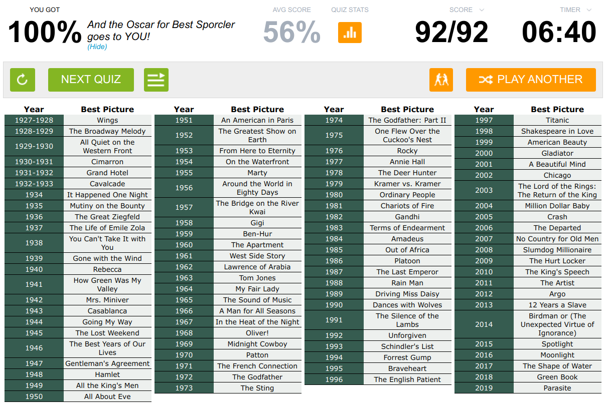

This week I learned all the winners of the Academy Award for Best Picture, by year. It took me 5 days. Here's how I did it.

## My tool: `quizme`

I wrote a flashcard-style quizzing tool to help me learn, which I named `quizme`. It's available on Github [here](https://github.com/Gredelston/quizme).

The basic structure is: The tool prompts you with a year (say, 1964). You respond with the title of the film that won the award in that year (_My Fair Lady_). The tool checks whether you were right. Repeat.

`quizme` has a few useful features. You can filter the data by decade(s). You can attempt a "challenge," where you will be asked each prompt exactly once, in either random order or chronological order. The tool reports on your score as a running total. You can specify alternate acceptable forms of answers, such as "Birdman" for *Birdman or (The Unexpected Virtue of Ignorance)*, although I preferred to reinforce the full form of each title.

It works a treat. In fact, I found it to be more effective than repeated Sporcle quizzing. The decade-filtering allowed me to learn in nice, discrete chunks. The randomly arising repetition—say, being prompted for 1962 three times in a row—turned out to be a great way to get a foothold. 10/10, would use again.

## My methodology

I learned one decade at a time.

For some decades, I started by reviewing the list of winners on Wikipedia, with the intent to learn a bit about any film I hadn't heard of. *Midnight Cowboy* is the only X-rated film to ever win the award. *In the Heat of the Night* is a buddy cop film. Et cetera.

Then I ran `quizme` on the decade for about 100 questions. My scores ranged from 74% to 91%. The vast majority of my failures were within the first 30 questions.

To seal off the decade, I attempted both a random-order challenge and a chronological-order challenge. I think I always aced those, save for the odd typo.

If I had already learned another decade that day, I then tried to integrate my knowledge via a random-order and a chronological-order challenge of the decades combined. This was tricky and useful: I often confused the two films whose years ended in the same digit, such as *Patton* (1970) and *Ordinary People* (1980).

I also quizzed myself periodically while away from the tool. While doing the dishes. While climbing the stairs. Recite the 1950s in order. In reverse chronological order. Sometimes my girlfriend generously humored me by prompting me with random years, which made me feel simultaneously very cool and very uncool. I found that speaking the knowledge was a helpful way to detach it from the computer-terminal part of my brain.

## Emergent mnemonics

Brains are skilled pattern-recognizers. I didn't seek mnemonics; my brain discovered them for free over the course of quizzing. Here's a brief sampling of patterns that I found helpful.

- Lots of films from years ending in "5" contain 5-letter words: *MARTY*, *The SOUND of MUSIC*, *BRAVE/HEART*, *CRASH*.
- The 60s had a lot of musical theater: *West Side Story*, *My Fair Lady*, *The Sound of Music*, *Oliver!*.
- The 70s had a lot of *The Blank* films, all in a row: *The French Connection*, *The Godfather*, *The Sting*, *The Godfather Part II*, *One Flew Over THE Cuckoo's Nest*. And a few years later, *The Deer Hunter*.
- The 1980s had a lot of biopics and historical films: *Chariots of Fire*, *Gandhi*, *Amadeus*, *Out of Africa*, *The Last Emperor*.
- In the 1930s, the two Z-films (*The Great Ziegfeld* (1936) and *The Life of Emile Zola* (1937)) are immediately adjacent, and sorted alphabetically by their Z-word.
- For the 1940s, I made up a bit of a narrative. *How Green Was My Valley* (1941) is a sentence that might be wistfully spoken by the American people, who were just entering WWII, yearning for the more peaceful days of the Great Depression (a "valley"). *Mrs. Miniver* (1942) is just a wartime film. *Going My Way* (1944), by its title, symbolizes the U.S. deciding that they're going to end the war the next year in an unconventional way. *The Lost Weekend* (1945), by its title, symbolizes all that was lost by that war-ending maneuver, although much more than a weekend was lost. *The Best Years of Our Lives* (1946), by its title, symbolizes a tongue-in-cheek, post-war reflection by the American military on how great the war was. (In fact, I think that might be what the actual film was about.)
- From the 90s onward, mnemonics were more tied to my personal life. *The Silence of the Lambs* (1991) was the year in which my oldest sibling—my parents' youngest lamb—was born. *Schindler's List* (1993) was the year in which I, a Jew, was born. *No Country for Old Men* (2007) was the year I began high school, and I remember hearing my friends mention the movie in the freshman section of the school cafeteria. *The King's Speech* (2010) I watched on a plane in 2011 shortly after hearing that it had won the award. Et cetera.

## My Progression

In order to track my progress, I took [the relevant Sporcle quiz](www.sporcle.com/games/boknowsmovies/best_pictures) every day.

**February 19:** 13/92 (A half-assed attempt.)

**February 20:** 37/92 

**February 21:** 57/92 

**February 23:** 78/92 

**February 24:** 92/92! 

## Next Steps

1. I'll keep quizzing myself on these films for a few days in order to secure their useless place in my brain. I should also set a yearly reminder to quiz myself on them.
2. I would like to learn **country flags**, which I consider even more intimidating than Best Picture winners, and which have always stumped me. I'll have to update `quizme` to accommodate images. The data set is twice as large as for best-picture winners, but that's an implementation detail. We'll get there.
3. The Academy Awards for Best Actor and Best Actress rear their ugly heads occasionally in trivia contexts, and would be good to learn as well. But for now, those seem intractable, considering how few actors/actresses I can name pre-1970. So that's on the someday/maybe list.

