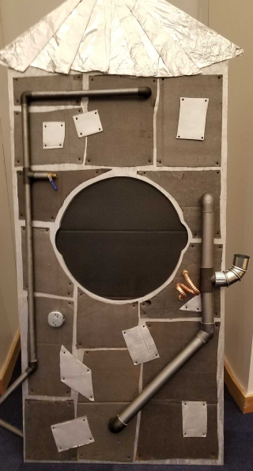
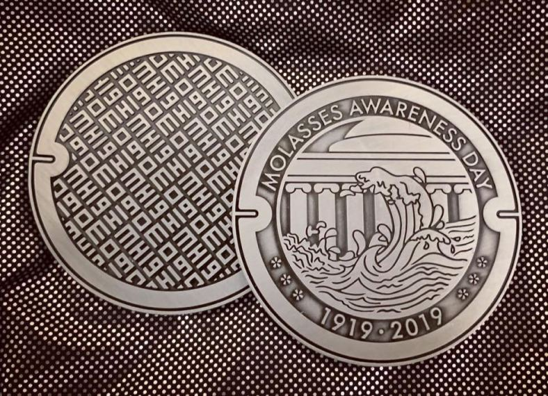

*This is a part of a series about MIT Mystery Hunt 2019. It is preceded by “[Puzzlehunts: An Overview](/puzzlehunts-an-overview),” and proceeded by “[Part 2: Structure](/recapping-mystery-hunt-2019-part-2-structure)” and “[Part 3: My Puzzles](/recapping-mystery-hunt-2019-part-3-my-puzzles).”*

**Note:** While I was on the team which wrote this year’s Mystery Hunt, I had very little impact on the story. My efforts were focused on writing, testing, and laying out puzzles.

##Kickoff
*Some folks might prefer to watch the [kickoff video](https://www.youtube.com/watch?v=fZ4V_PDNEv0). It’s 28 minutes long.*

Three days before the start of Hunt marked the one hundredth anniversary of Boston’s [Great Molasses Flood](https://en.wikipedia.org/wiki/Great_Molasses_Flood), the funniest tragedy to have ever hit our city. To commemorate the occasion, Setec Astronomy, the team running Hunt, declare January 18, 2019 to be Molasses Awareness Day. Hooray!

At that moment, Santa Clause and Jack Skellington appear on behalf of the Administrative Division of the Holiday Oversight Council (AD HOC). They inform the audience that whenever a holiday is created, a corresponding holiday town is simultaneously created in the Holiday Forest from [*The Nightmare Before Christmas*](https://en.wikipedia.org/wiki/The_Nightmare_Before_Christmas).

Representatives from nearby holiday towns (Thanksgiving Town, et al.) announce that a manhole cover has gone missing from the molasses tower in Molasses Awareness Day Town. The ensuing molasses flood is causing problems between the towns in the Holiday Forest.

Thus commences a Hunt in which solvers must (a) solve puzzles to clean up molasses, (b) solve the flood-induced problems between adjacent towns, and (c) find the manhole cover to stop the flood.

##Midgame
After your team has solved the first five inter-town problems, a new town appears in the holiday forest: [Your Birthday Town](http://web.mit.edu/puzzle/www/2019/town/your_birthday.html). The mayor of Your Birthday Town arrives at your team’s headquarters to throw you a birthday party. Hooray!

The mayor hands your team a beautiful birthday present and encourages you to open. it. A quick glance reveals that the present is padlocked four times over. But nevermind that; let’s play some party games!

After [a rousing series of games](http://web.mit.edu/puzzle/www/2019/solution/your_birthday.html), your team figures out how to disengage all four locks. You open the box and look inside to find that it is… empty!

*APRIL FOOLS!* The mayor tears off their outfit and birthday hat to reveal a jester’s outfit underneath, betraying their true identity: the April Fool! (“You actually thought that there was a Your Birthday Town? What would that even mean?!”)

The Fool delivers a heartfelt monologue in which they confess to stealing the manhole cover in order to incite fun and chaos in these boring woods. Cackling, they run back to April Fools Day Town. And you continue solving puzzles.

##Endgame
After solving all fifteen inter-town problems and [discerning](http://web.mit.edu/puzzle/www/2019/solution/april_fools_day.html) that the April Fool intends to pull a **JEST IN THE TIME OF NICK**, your team begins a [final interaction](http://web.mit.edu/puzzle/www/2019/solution/molasses_awareness_day.html) with Jack Skellington, Santa Clause, and the April Fool.

The Fool announces their diabolical plan to replace the sugar in all of the Christmas Town cookies with molasses, giving them (the cookies) a slightly more robust flavor. Cruel indeed! Santa Claus helps the Fool realize that their pranks are killing people, which is bad. So they (the Fool) agree to help the team find the manhole cover.

Your team solves one more puzzle in order to unlock a box supposedly containing the Fool’s notes about where they hid the manhole cover. You eventually decode the instruction **USE A MISSILE TOE**. You kick the box, which swings open, thanks to the magic of electronics. You peer inside to find that the box is… empty! *APRIL FOOLS!* Always a classic.

The Fool hands you their actual notes, kicking off the final runaround. Your team runs across MIT’s campus to the first five holiday towns. Eventually you find an instruction telling you to go to Your Birthday Town, accompanied by a photograph of your team’s headquarters. You run back to your HQ, where you find that the manhole cover. It was there the whole time!

Finally, you lug the manhole cover to a certain room at MIT, where you discover a steampunky molasses tower with a giant manhole. You insert the cover, thus stopping the flow of molasses.

Jack and the Fool reminisce about how much fun the flood was. Together, they decide that it would be nice to maintain a small flow of molasses: a “treacle trickle.” Upon deeper inspection of the tower, your team discovers a miniature manhole cover which can be removed.

You extract the coin. You have saved the Holiday Forest and won Mystery Hunt.

*Photo credit: The Molasses Tower was photographed by Connor Stokes. The coin was photographed by [Roger Ford](https://rogerford.org/).*
