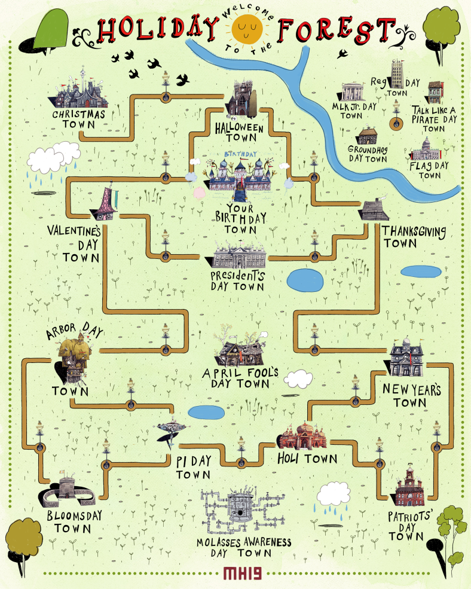

*This is a part of a series about MIT Mystery Hunt 2019. It is preceded by “[Puzzlehunts: An Overview](/puzzlehunts-an-overview)” and “[Part 1: Story](/recapping-mystery-hunt-2019-part-1-story),” and proceeded by “[Part 3: My Puzzles](/recapping-mystery-hunt-2019-part-3-my-puzzles).”*

**Note:** While I was on the team which wrote this year’s Mystery Hunt, I had very little impact on the overall structure. My efforts were focused on writing, testing, and laying out puzzles.

##Rounds == Holiday Towns
Each round of this year’s Hunt represented one holiday town in the Holiday Forest from [*The Nightmare Before Christmas*](https://en.wikipedia.org/wiki/The_Nightmare_Before_Christmas).

Initially, solvers were presented with a handful of puzzles in Christmas Town. After completing their first puzzle, solvers unlocked the first puzzle in the next town: Halloween Town. After completing eight more puzzles, Thanksgiving Town materialized. And so on.

The full list of main holiday towns, in the order in which they appear (and, roughly, in increasing order of esotericism), is as follows:

1. Christmas Town
1. Halloween Town
1. Thanksgiving Town
1. Valentine’s Day Town
1. President’s Day Town
1. New Year’s Town
1. Arbor Day town
1. Holi Town
1. Pi Day Town
1. Patriots’ Day Town
1. [Bloomsday Town](https://en.wikipedia.org/wiki/Bloomsday)

The existence of each holiday town was revealed to solving teams as soon as they unlocked the first puzzle from that round.

##Metapuzzles == Problems
The flooding molasses is causing unprecedented interactions between the holiday towns! And as we all know, interacting with your neighbors can only lead to problems.

Each problem (yes, that’s the official term) straddles two adjacent towns, requiring some answers from each of the two towns. But we don’t tell you which answers are associated with which problems. As someone on my team explained, “that’s part of the hard part.”

Here are all the problems, in what I consider to be increasing order of difficulty, but YMMV. You can get the solutions by clicking “SOLUTION” in the top-right of each problem page.

1. [Christmas Town × Halloween Town](http://web.mit.edu/puzzle/www/2019/problem/christmas_halloween.html)
1. [Thanksgiving Town × President’s Day Town](http://web.mit.edu/puzzle/www/2019/problem/thanksgiving_presidents_day.html)
1. [Halloween Town × Thanksgiving Town](http://web.mit.edu/puzzle/www/2019/problem/halloween_thanksgiving.html)
1. [Halloween Town × Valentine’s Day Town](http://web.mit.edu/puzzle/www/2019/problem/halloween_valentines_day.html)
1. [Valentine’s Day Town × President’s Day Town](http://web.mit.edu/puzzle/www/2019/problem/valentines_day_presidents_day.html)
1. [Valentine’s Day Town × Arbor Day Town](http://web.mit.edu/puzzle/www/2019/problem/valentines_day_arbor_day.html)
1. [Holi Town × Pi Day Town](http://web.mit.edu/puzzle/www/2019/problem/holi_pi_day.html)
1. [Arbor Day Town × Pi Day Town](http://web.mit.edu/puzzle/www/2019/problem/arbor_day_pi_day.html)
1. [Thanksgiving Town × New Year’s Town](http://web.mit.edu/puzzle/www/2019/problem/thanksgiving_new_years.html)
1. [Pi Day Town × Bloomsday Town](http://web.mit.edu/puzzle/www/2019/problem/pi_day_bloomsday.html)
1. [Arbor Day Town × Bloomsday Town](http://web.mit.edu/puzzle/www/2019/problem/arbor_day_bloomsday.html)
1. [New Year’s Town × Holi Town](http://web.mit.edu/puzzle/www/2019/problem/new_years_holi.html)
1. [Holi Town × Patriot’s Day Town](http://web.mit.edu/puzzle/www/2019/problem/holi_patriots_day.html)
1. [New Year’s Town × Patriot’s Day Town](http://web.mit.edu/puzzle/www/2019/problem/new_years_patriots_day.html)

Because you didn’t know which answers were associated with which problems, these were some really hard metapuzzles. The leading teams sometimes went eight hours or more between meta solves. After our 17-hour Hunt in 2017, I was happy with these results.

##Events
Per tradition, teams were invited to participate in a series of in-person events. It helps to break up the monotony of solving puzzles. You can read all about them here:

* [Groundhog Day](http://web.mit.edu/puzzle/www/2019/solution/groundhog_day.html)
* [Flag Day Town](http://web.mit.edu/puzzle/www/2019/solution/flag_day.html)
* [MLK Day Town](http://web.mit.edu/puzzle/www/2019/solution/martin_luther_king_jr_day.html)
* [Talk Like a Pirate Day Town](http://web.mit.edu/puzzle/www/2019/solution/talk_like_a_pirate_day.html)
* [Reg Day Town](http://web.mit.edu/puzzle/www/2019/solution/registration_day.html)&mdash;that is, MIT Course Registration Day Town

Upon completing each event, teams received a 3D printed structure made of unit cubes. By arranging these structures in the correct orientation, solvers were able to assemble the likeness of MIT’s Killian Court, which was the key insight required to solve [the events metapuzzle](http://web.mit.edu/puzzle/www/2019/solution/events.html).

##Extra Towns
After solving the first five problems, teams unlocked [Your Birthday Town](http://web.mit.edu/puzzle/www/2019/town/your_birthday.html). Calling in the interaction request **PARTY ON** initiated the midgame sequence, [which I described earlier](https://gredelston.cool/2019/01/22/a-recap-of-mystery-hunt-2019-part-1-story/).

After unlocking all other puzzles, solvers saw another town on their map: [April Fool’s Day Town](http://web.mit.edu/puzzle/www/2019/town/april_fools_day.html). This town had no instructions.

Solvers uncovered that each town (other than Christmas Town) had one extra puzzle whose answer was not used in any of its problems. These were all pranks that the April Fool played on other holiday towns. Using these answers, solvers deciphered the April Fool’s plan to pull a **JEST IN THE TIME OF NICK**. [Read the full solution here](http://web.mit.edu/puzzle/www/2019/solution/april_fools_day.html).

Finally, after teams had completed all 15 metapuzzles (including April Fool’s Day Town) and the Your Birthday Town interaction, [Molasses Day Town](http://web.mit.edu/puzzle/www/2019/town/molasses_awareness_day.html) appeared on the map. By calling in the interaction request **WON’T GET FOOLED AGAIN**, teams triggered the endgame sequence, [which I also described earlier](https://gredelston.cool/2019/01/22/a-recap-of-mystery-hunt-2019-part-1-story/).

##Unlocking Puzzles
There were two ways to unlock puzzles: by time release, or by completing sufficiently many puzzles.

Within the story, the time release signified that Santa had found a puzzle to deliver to all the teams. This happened every 30 minutes early in the hunt; later, Santa sped up to every 20 minutes, and then every 15 minutes. At 6:00P.M. on Sunday, all teams had access to all 159 puzzles.

By solving puzzles, teams could unlock puzzles faster than Santa would deliver them. Within the story, this signified Jack Skellington helping Santa deliver puzzles to the eager solvers.

Santa delivered each puzzle to all teams at the same time. If a team had already unlocked the puzzle that Santa was delivering, then that did not entitle the team to receive the next puzzle in the queue. Rather, it meant that they were ahead of the curve. If they kept on solving puzzles, then Jack would keep delivering puzzles. Otherwise, they would fall back onto the Santa curve.

Only two teams stayed ahead of the Santa Curve throughout the entire Hunt.

This unlocking mechanism, in my view, benefited everyone. Large teams were able to keep unlocking puzzles without having 40+ puzzles open at once (as happened in 2017’s famously short *Monsters et Manus*). Smaller teams had a constant inflow of new puzzles to play with, so it didn’t terribly matter when they got stuck. And everyone eventually got to see every puzzle, which is wonderful.

##Solvent
Some years, Hunt has a built-in hint mechanism. This year, we had “solvent.”

Teams accumulated solvent by completing each event and by solving the events metapuzzle. A team could use solvent on a puzzle in order to know which problem it is associated with.

Teams love to hoard their resources. In order to encourage teams to use their solvent, there was a cap on how much solvent a team could have at a time. Use it or lose it.

##Parting Thoughts
Our team was thoughtful and deliberate about using our high-level structure to solve specific problems, such as preventing large teams from rushing through the Hunt. In my view, that deliberation paid off.

Stay tuned to see what puzzles I wrote.

*Image credit: Holiday Forest art by [Roger Ford](https://rogerford.org/).*